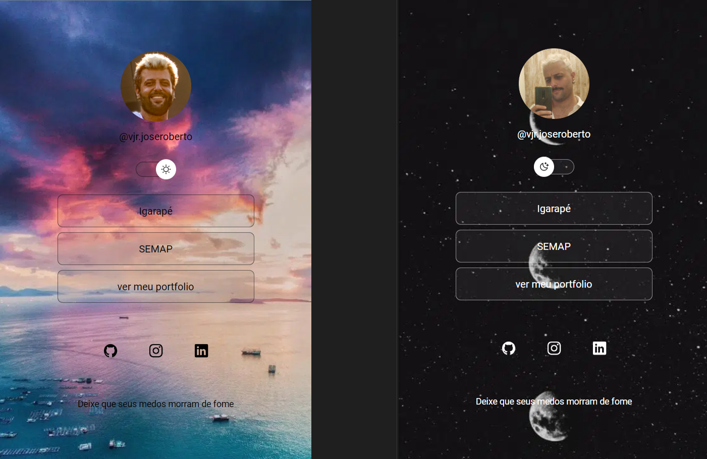

<h1 align="center"> DevLinks </h1>

Desenvolvido para utilizar como cartão de visita online de um Dev  
<!--<a href="https://lp.rocketseat.com.br/devlinks/inscricao?utm_source=github&utm_medium=descricao&utm_campaign=capture-devlinks&utm_term=organic&utm_content=descricao-github-mayk-brito">Estude esse projeto em formato de vídeo clicando aqui.</a> -->

  <a href="#-tecnologias">Tecnologias</a>&nbsp;&nbsp;&nbsp;|&nbsp;&nbsp;&nbsp;
  <a href="#-projeto">Projeto</a>&nbsp;&nbsp;&nbsp;|&nbsp;&nbsp;&nbsp;
  <a href="#-layout">Layout</a>&nbsp;&nbsp;&nbsp;|&nbsp;&nbsp;&nbsp;
  <a href="#memo-licença">Licença</a>

  

 

  

## 🚀 Tecnologias

Utilizei as seguintes tecnologias para desenvolver esse cartão de visitas online:

- HTML e CSS
- JavaScript
- Git e Github
<!-- - Figma -->
- VSCode

## 💻 Projeto

O DevLinks é um agregador de links para usar como cartão de visitas online.

- [Acesse o projeto finalizado, online](https://github.com/vjr-joseroberto/Links-perfil)

<!--- [Assistir aulas](https://lp.rocketseat.com.br/devlinks/inscricao?utm_source=github&utm_medium=descricao&utm_campaign=capture-devlinks&utm_term=organic&utm_content=descricao-github-mayk-brito) -->

## 🔖 Layout

Layout do projeto foi desenvolvido por mim, atraves das aulas da [RocketSeat](www.rocketseat.com.br) e do professor Mayke Brito, onde inicei os estudo como Dev

## :memo: Licença

Esse projeto está sob a licença MIT.

# Links-perfil
